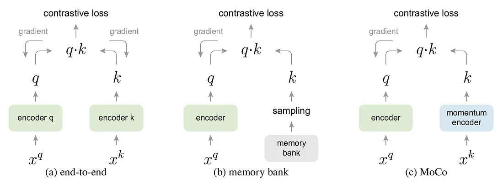
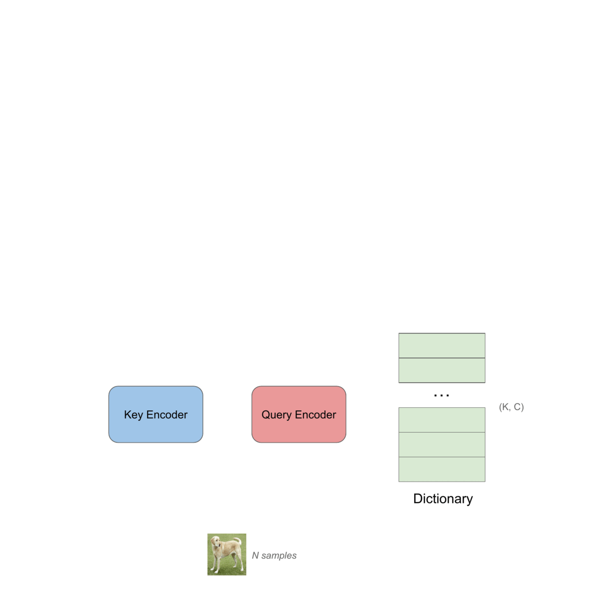

# Paper explained — Momentum Contrast for Unsupervised Visual Representation Learning [MoCo]

MoCo which stands for Momentum Contrast has first appeared in the paper: *Momentum Contrast for Unsupervised Visual Representation Learning* by He et al. in 2020.

Several studies achieved promising results in unsupervised visual representation learning using contrastive learning by building dynamic dictionaries that contain key representations of data samples (images or patches) produced by an encoder model.

It is hypothesized in this paper that in order to enhance the quality of the feature representation, we should have:

- **A big dictionary size**: The dictionary can be seen as a sample of all the images dataset. So clearly a big dictionary is better at sampling our high-dimensional pixels space.
- **A consistent dictionary as it evolves during the training**: It means that all the keys are produced by the same encoder, or at least a similar one.

## The dictionary is built as a queue:

As the size of the dictionary is limited by memory, it still needs to sample the whole dataset as good as possible. An intuitive solution would be to use a **queue as a dictionary** that will repeatedly get updated during the training, such as in a given learning step, the most recent encoded keys are enqueued (pushed), and the oldest ones are dequeued.

## The training:

In this method, we use two models, a **query encoder** model and a **key encoder** model. Both models are convolutional neural networks (a ResNet-50 in the paper) that take an input as an image (or a patch) and output its representation.

We first start by uniformly sampling a batch of images from the dataset upon which we create two randomly augmented sets of views: the **query views** and the **key views**. Both views are then passed to the **query encoder** and **key encoder** respectively, that will output the **query representation** and the **key representation**.

The loss is calculated using a variant of the NCE loss as following:

$$\mathcal{L}_q = -\log \frac{\exp(q \cdot k_+ / \tau)}{\sum_{i=0}^K \exp(q \cdot k_i / \tau)}$$

*where:*

- **q** is the query representation.
- **k+** is the corresponding key (the one generated from the other augmented view of the query) we call it the **positive sample**.
- **k-i** are the keys that are stored in the dictionary, we call them the **negative samples**.
- **t** is the temperature and it indicates how strict the loss function is with

This loss function ( like most contrastive loss functions ) will try to **minimize the distance between q and k+, and maximize it between q and k-**.
In other words, it will pull the views that have been augmented from the same sample together and push away those that didn’t come from the same samples.

## The key encoder is a momentum moving average of the query encoder:

The key encoder won’t get updated using back propagation, as the gradients will flow all the way down to all of the dictionary representation which makes it quite expensive. A naive solution would be to copy the parameters of the key encoder from the query encoder, but this solution yields bad experimental results, because the parameters were rapidly changing which led to reducing the representations’ consistency of the dictionary.

Another solution is to do **momentum updates.** The parameters of the encoder would update by:

$$\theta_k \leftarrow m\theta_k + (1-m)\theta_q.$$

where **m** is the **momentum coefficient** with a value in [0, 1). This makes the parameters of the key encoder update more smoothly than those of the query encoder which will lead to much more consistent representations in the dictionary. Experiments have shown that a big momentum coefficient like 0.999 yields far better results than a smaller value like 0.9 (yes 0.9 is small!).

By the end of the training, only the query encoder is kept to be used as a feature extractor to solve downstream tasks like image classification and object detection.

## Reference:
[Momentum Contrast for Unsupervised Visual Representation Learning](https://arxiv.org/abs/1911.05722)